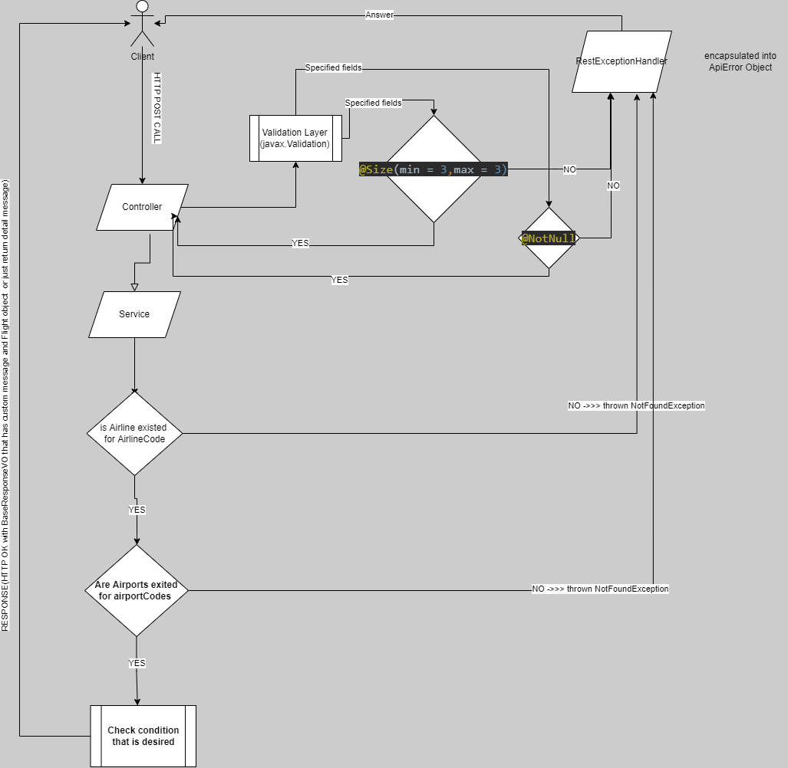
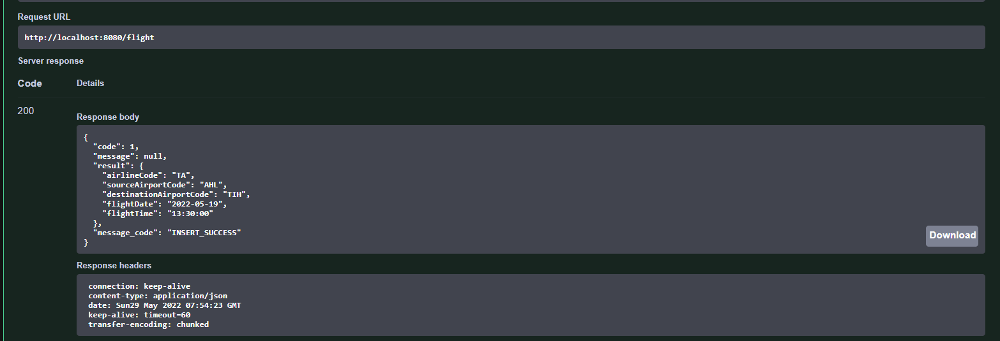
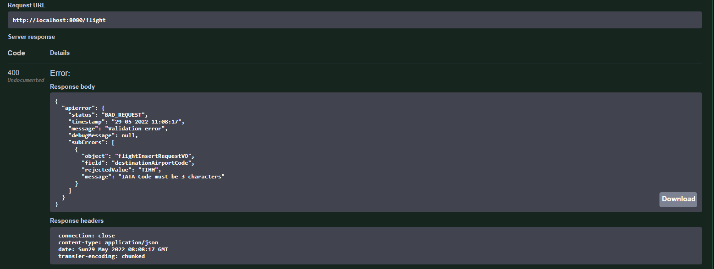
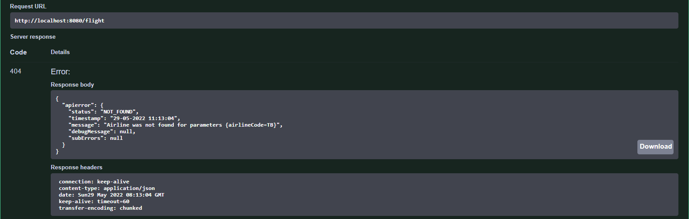
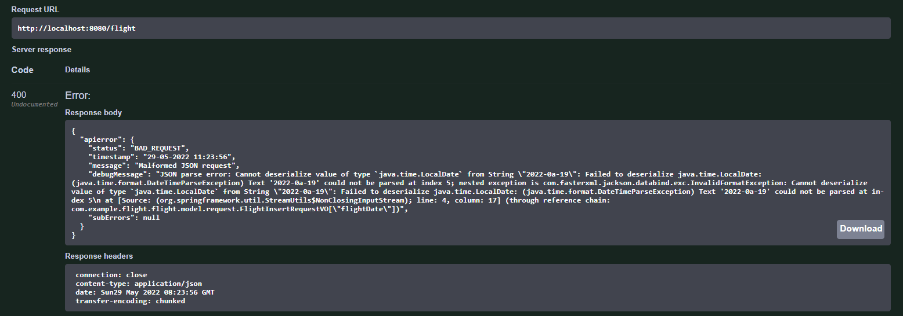
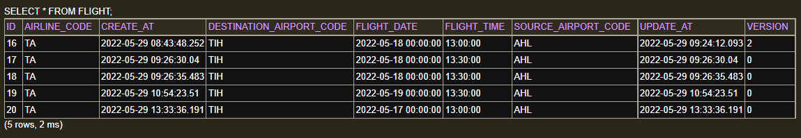
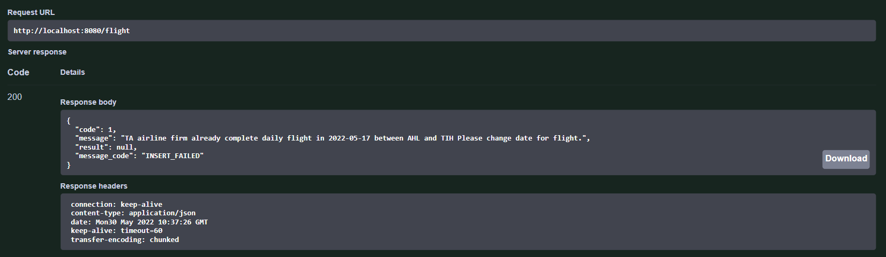

# Flight-Planning-API

Flight Project API is a REST service which enables making CRUD operations with data described below.
There are three entities respectively described below :
- Airline 
- Airport
- **Flight** <br/>

#### Airline and airport entities are just created to make flight operations more realistic.
#### Project aims to  fulfill appropriately flight CRUD operations.
### Swagger and H2 Embedded Database Interface URL :
- http://localhost:8080/swagger-ui/#/
- http://localhost:8080/h2-console

### Libraries that are used in Project 
- **Lombok** : it is used to replaces boilerplate code with easy-to-use annotations (Example : @Data(for creating automatically getter and setter for class)
- **javax.validation** : it is used to validate user input that is like requested (Example : @Size(min=2,max=2) for restricting the object field or parameter as size.
- **springfox(Swagger)** : it is used to syncronize the API documentation with the server and client at the same pace.

## Flight-Controller endpoints

### HTTP Post Call Flowchart

### Create flight (Post method) 
 - **Request (Application/JSON)**
```
{
  "airlineCode": "TA",
  "destinationAirportCode": "TIH",
  "flightDate": "2022-05-19",
  "flightTime": "13:30:00",
  "sourceAirportCode": "AHL"
}
```
 -  Post Response on Swagger :


- Bad Request Response :


- **Response Code :404,EntityNotFoundException** (application/json)


- **Response Code :400, HttpMessageNotReadableException**(application/json)<br />
  - When we send a request object with wrong LocalDate input
  - **Request** :
  ```
   {
  "airlineCode": "TB",
  "destinationAirportCode": "TIH",
  "flightDate": "2022-0a-19",
  "flightTime": "13:30:00",
  "sourceAirportCode": "AHL"
   }
   ```
  -  **Response** : 
 
 - **Response Code :200** (application/json) (Business Logic failed example)
   - When we send a post flight request with date that already full for creating flight in airline between two destination
   - **Request** :
  ```
   {
   "airlineCode": "TA",
   "destinationAirportCode": "TIH",
   "flightDate": "2022-05-18",
   "flightTime": "13:00:00",
   "sourceAirportCode": "AHL"
   }
  ```
  - Database :
  
  - Response :
  
 

