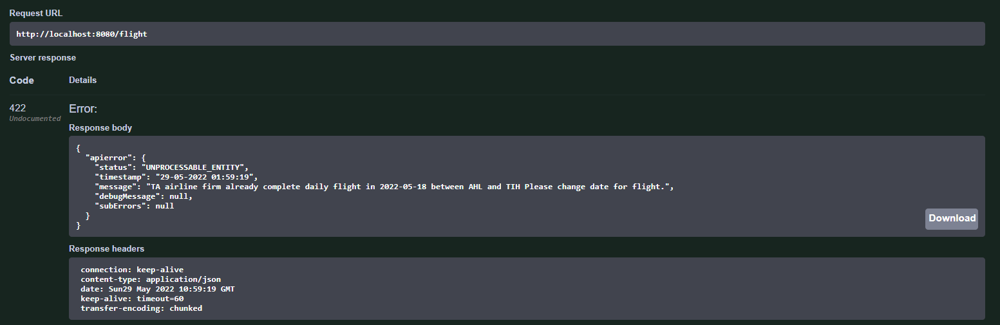

# Flight-Planning-API

Flight Project API is a REST service which enables making CRUD operations with data described below.

## Flight-Controller endpoints

### HTTP Post Call Flowchart

### Create flight (Post method) 
 - Request (Application/JSON)
```
{
  "airlineCode": "TA",
  "destinationAirportCode": "TIH",
  "flightDate": "2022-05-19",
  "flightTime": "13:30:00",
  "sourceAirportCode": "AHL"
}
```
 -  Post Response on Swagger :


- Bad Request Response :


- Response Code :404,EntityNotFoundException (application/json)


- Response Code :400, HttpMessageNotReadableException(application/json)<br />
  - When we send a request object with wrong LocalDate input
  - Request :
  ```
   {
  "airlineCode": "TB",
  "destinationAirportCode": "TIH",
  "flightDate": "2022-0a-19",
  "flightTime": "13:30:00",
  "sourceAirportCode": "AHL"
   }
   ```
  -  Response : 
 
 - Response Code :422,UNPROCESSABLE_ENTITY (application/json) 
   - When we send a post flight request with date that already full for creating flight in airline between two destination
   - Request :
  ```
   {
   "airlineCode": "TA",
   "destinationAirportCode": "TIH",
   "flightDate": "2022-05-18",
   "flightTime": "13:00:00",
   "sourceAirportCode": "AHL"
   }
  ```
  - Database :
  
  - Response :
  
 

